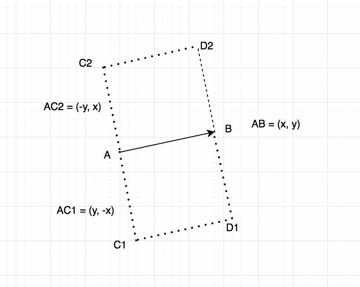
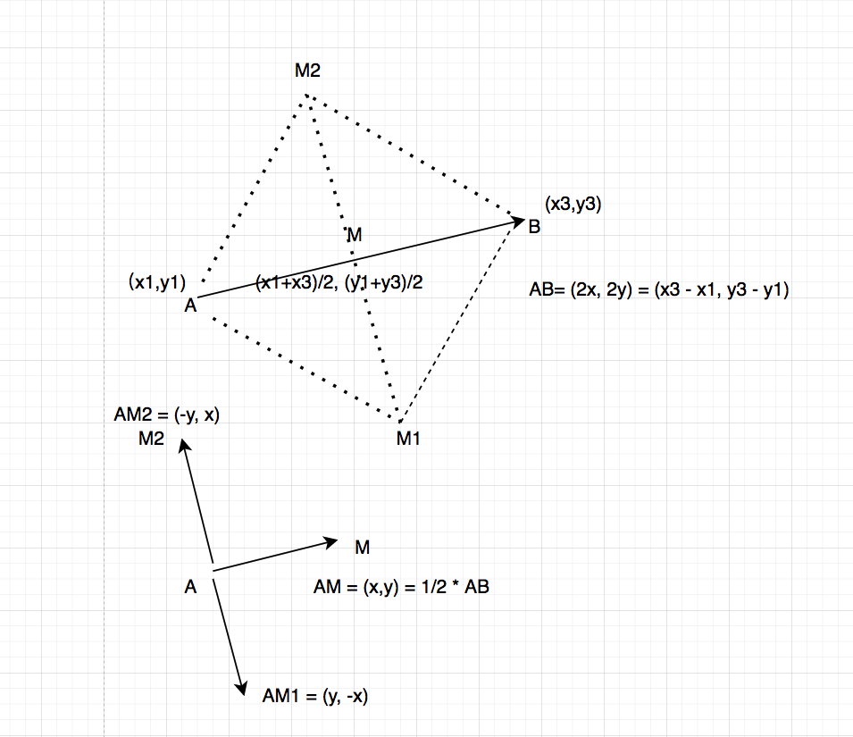

# To NaNa

CREATED 2022-12-06

## Find All Squares

### Method One - Calculate other two points in parallel edge



```
using namespace std;

/*
Given a list of points, find all the possible squares

*/
bool pointExists(map<vector<int>, int>& treeMap, int x, int y) {
    return treeMap.count({x, y}) != 0;
}

set<vector<vector<int>>> findSquaresMethod1(vector<vector<int>>& points) {
    int length = points.size();
    set<vector<vector<int>>> result;
    // Store all points into a hashMap (actually treeMap in C++) 
    // to conveniently determine where a point exists or not.
    map<vector<int>, int> treeMap;
    for (auto it: points)treeMap[it]++;
    
    for(int i = 0;i < length;i++) {
        int pointAx = points[i][0];
        int pointAy = points[i][1];
        for(int j = i + 1;j < length;j++) {
            int pointBx = points[j][0];
            int pointBy = points[j][1];
            
            int deltaX = pointBx - pointAx;
            int deltaY = pointBy - pointAy;
            if (deltaX * deltaX + deltaY * deltaY == 0)continue;

            // Part One - Determine C1, D1 exists or not
            // From A + (+deltaY, -deltaX) to point C1
            int pointC1x = pointAx + deltaY;
            int pointC1y = pointAy - deltaX;
            
            // Determint whether point C1 exists or not, if yes, further check D1
            if (pointExists(treeMap, pointC1x, pointC1y)) {
                int pointD1x = pointC1x + deltaX;
                int pointD1y = pointC1y + deltaY;
                if (pointExists(treeMap, pointD1x, pointD1y)) {
                    vector<vector<int>> square = {points[i], points[j], {pointC1x, pointC1y}, {pointD1x, pointD1y}};
                    sort(square.begin(), square.end());
                    result.insert(square);
                    // Sort and dedup for inserting into the set (actually TreeSet in C++)
                }
            }
                
            // Part Two - Determine C2, D2 exists or not
            // From point A + (-deltaY, +deltaX) to point C2
            int pointC2x = pointAx - deltaY;
            int pointC2y = pointAy + deltaX;

            // Determint whether point C2 exists or not, if yes, further check D2
            if (pointExists(treeMap, pointC2x, pointC2y)) {
                int pointD2x = pointC2x + deltaX;
                int pointD2y = pointC2y + deltaY;
                if (pointExists(treeMap, pointD2x, pointD2y)) {
                    vector<vector<int>> square = {points[i], points[j], {pointC2x, pointC2y}, {pointD2x, pointD2y}};
                    sort(square.begin(), square.end());
                    result.insert(square);
                }
            }
        }
    }
    return result;
}
```

### Method Two - Calculate middle point and then other two points diagonally



```
set<vector<vector<int>>> findSquaresMethod2(vector<vector<int>>& points) {
    int length = points.size();
    set<vector<vector<int>>> result;
    // Store all points into a hashMap (actually treeMap in C++) 
    // to conveniently determine where a point exists or not.
    map<vector<int>, int> treeMap;
    for (auto it: points)treeMap[it]++;
    
    for(int i = 0;i < length;i++) {
        int pointAx = points[i][0];
        int pointAy = points[i][1];
        for(int j = i + 1;j < length;j++) {
            int pointBx = points[j][0];
            int pointBy = points[j][1];
            
            int deltaX = pointBx - pointAx;
            int deltaY = pointBy - pointAy;
            if (deltaX * deltaX + deltaY * deltaY == 0)continue;
            
            // Part One - Determine M1, M2 exists or not
            // Calculate the middle point between point A and B first, called M
            // To avoid calculate double type like 3.5, 
            // we store the 2 times of the number, it must be integer like 7.
            int pointMxTimes2 = pointAx + pointBx;
            int pointMyTimes2 = pointAy + pointBy;
            
            // AB = (deltaX, deltaY), AM = (deltaX / 2, deltaY / 2)
            // AM1 = (-deltaY / 2, +deltaX / 2)
            // AM2 = (+deltaY / 2, -deltaX / 2)
            
            // M1 point: ((Mx - deltaY)/2, (My + deltaX)/2)
            int pointM1xTimes2 = pointMxTimes2 - deltaY; 
            int pointM1yTimes2 = pointMyTimes2 + deltaX;
            if (pointM1xTimes2 % 2 != 0 || pointM1yTimes2 % 2 != 0) continue;
            
            // M2 point: ((Mx + deltaY)/2, (My - deltaX)/2)
            int pointM2xTimes2 = pointMxTimes2 + deltaY; 
            int pointM2yTimes2 = pointMyTimes2 - deltaX;
            if (pointM2xTimes2 % 2 != 0 || pointM2yTimes2 % 2 != 0) continue;
            
            int pointM1x = pointM1xTimes2/2; 
            int pointM1y = pointM1yTimes2/2;
            int pointM2x = pointM2xTimes2/2; 
            int pointM2y = pointM2yTimes2/2;
            if (pointExists(treeMap, pointM1x, pointM1y) &&
               pointExists(treeMap, pointM2x, pointM2y)) {
                vector<vector<int>> square = {points[i], points[j], {pointM1x, pointM1y}, {pointM2x, pointM2y}};
                    sort(square.begin(), square.end());
                    result.insert(square);
            }
        }
    }
    return result;
}

void printSquares(set<vector<vector<int>>>& squares) {
    for(vector<vector<int>> square: squares) {
        cout<<"[("<<square[0][0]<<","<<square[0][1]<<"),";
        cout<<"("<<square[1][0]<<","<<square[1][1]<<"),";
        cout<<"("<<square[2][0]<<","<<square[2][1]<<"),";
        cout<<"("<<square[3][0]<<","<<square[3][1]<<")]"<<endl;
    }
    cout<<endl;
}

void testFindSquares() {
    // vector<vector<int>> points = {{0,0},{1,0},{1,1},{0,1},{2,0},{2,1}};
    vector<vector<int>> points = {{0,0},{1,0},{1,1},{0,1},{2,0},{2,1},
                                  {0,2},{1,2},{2,2}};
    cout<<"Method 1 Testing"<<endl;
    set<vector<vector<int>>> squares1 = findSquaresMethod1(points);
    printSquares(squares1);
    cout<<"Method 2 Testing"<<endl;
    set<vector<vector<int>>> squares2 = findSquaresMethod2(points);
    printSquares(squares2);
}

int main() {
    testFindSquares();
    return 0;
}

／*
    https://leetcode.com/playground/W4Wv3hbg
    
    Finished in 0 ms
    Method 1 Testing
    [(0,0),(0,1),(1,0),(1,1)]
    [(0,0),(0,2),(2,0),(2,2)]
    [(0,1),(0,2),(1,1),(1,2)]
    [(0,1),(1,0),(1,2),(2,1)]
    [(1,0),(1,1),(2,0),(2,1)]
    [(1,1),(1,2),(2,1),(2,2)]

    Method 2 Testing
    [(0,0),(0,1),(1,0),(1,1)]
    [(0,0),(0,2),(2,0),(2,2)]
    [(0,1),(0,2),(1,1),(1,2)]
    [(0,1),(1,0),(1,2),(2,1)]
    [(1,0),(1,1),(2,0),(2,1)]
    [(1,1),(1,2),(2,1),(2,2)]
*／
```
